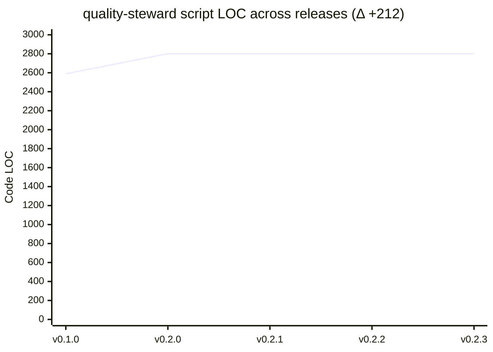

# quality-steward — self-dashboard

The tool, measured on itself. This is quality-steward dogfooding its own code-health story on the
quality-steward repository.

> **Honest scope (the tool eating its own dog food).** quality-steward's code is JavaScript
> (`.mjs` skill scripts) + Python (the deterministic CLIs) + Markdown — **not** a TypeScript/React
> app. So the full **CodeHealth grade** (Maintainability Index, TSDoc doc-coverage, the six-dimension
> roll-up) **does not apply here** — its producers are TS-first and find zero files in this repo.
> That's not a bug; it's exactly the boundary documented in [language support](language-support.md).
> Rather than fabricate a grade, this dashboard uses the **language-agnostic size/growth view** —
> the same fallback lens quality-steward offers any non-TS project.

## Codebase at a glance

Real counts from the tracked source at **v0.2.3** (`.mjs` + `.py`, code lines only):

| Area | Files | Code LOC |
|---|--:|--:|
| `security-audit/scripts` (the deterministic Python CLI) | 2 | 1051 |
| `code-health/scripts` (metrics producers + roll-up) | 17 | 950 |
| `code-readability/scripts` (doc generators) | 5 | 389 |
| `wiki-publish/scripts` (stamp + push substrate) | 2 | 83 |
| `code-quality/scripts`, `scripts/` (CLI + steward-metrics) | 2 | 328 |
| **Total script code** | **28** | **2801** |

Plus **42** Markdown documentation files (README, INSTALL, `docs/`, the blog, and each skill's
`SKILL.md`/`README.md`) — a docs-to-code ratio that reflects a tool whose product *is* partly its
documentation.

## 📈 Trend

quality-steward's script code across its releases — the honest equivalent of the CodeHealth-score
sparkline, using LOC (the metric that *does* apply to this repo). The step at **v0.2.0** is the
three scripts added by the capability release (`agnostic-report`, `portfolio-report`,
`steward-metrics`); the code has been flat since, as v0.2.1–v0.2.3 were workflow/doc fixes.

<!--ch:trend-->

<!--/ch:trend-->

The `<!--ch:trend-->` marker matches the convention the tool stamps on every dashboard it
publishes (e.g. the [nearestniceweather Code Health Dashboard](example-nearest-nice-weather.md)).
This page is also published to the project's **GitHub Wiki** (the tool's normal dashboard target),
where the same `wiki-publish` substrate can re-stamp it — so quality-steward hosts its dashboard
exactly the way it does for the projects it watches.

## Reproduce

```bash
# code LOC per release tag (.mjs + .py, excluding comment/blank lines)
for t in v0.1.0 v0.2.0 v0.2.1 v0.2.2 v0.2.3; do
  loc=$(git ls-tree -r --name-only "$t" | grep -E '\.(mjs|py)$' \
        | while read f; do git show "$t:$f"; done \
        | grep -cvE '^[[:space:]]*(//|#|/\*|\*|$)')
  echo "$t  $loc"
done
```

## Where the real grade lives

quality-steward produces genuine graded CodeHealth trends on the **TypeScript** projects it's
built for — see the live [nearestniceweather dashboard](example-nearest-nice-weather.md)
(**A · 94/100**, with the score-over-time `ch:trend` chart it now stamps).
